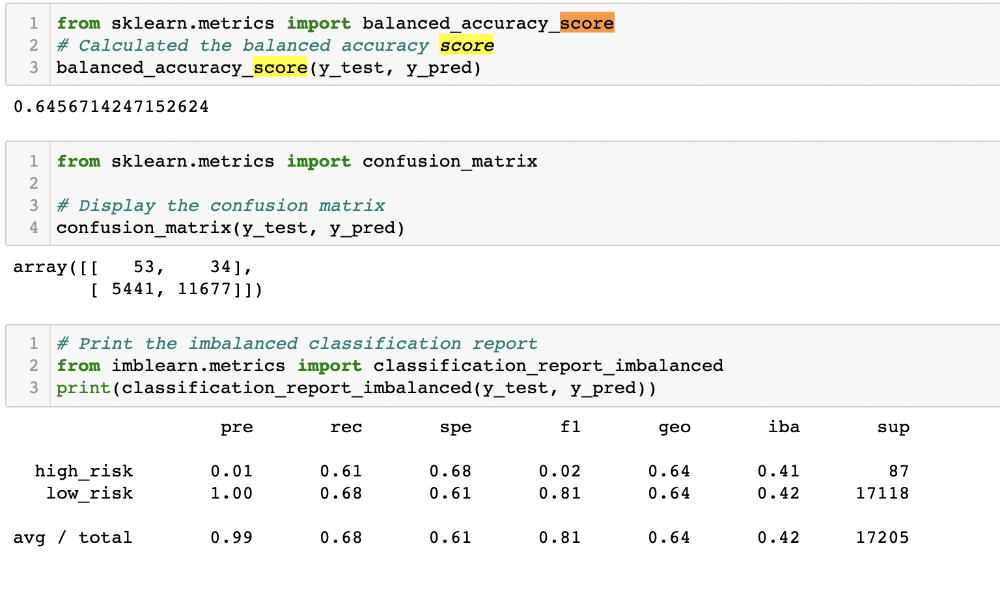
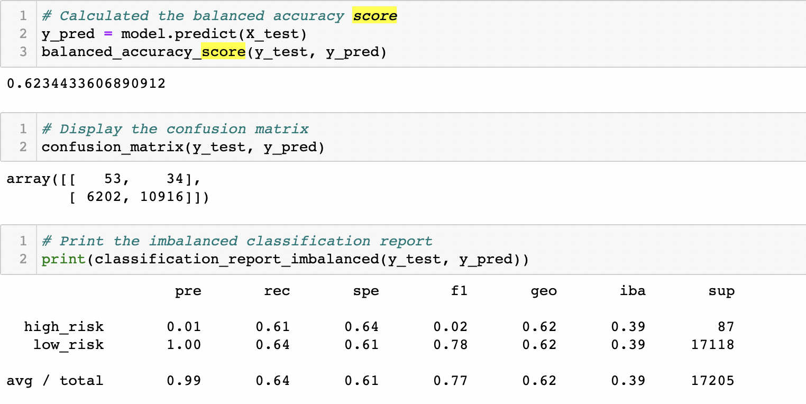
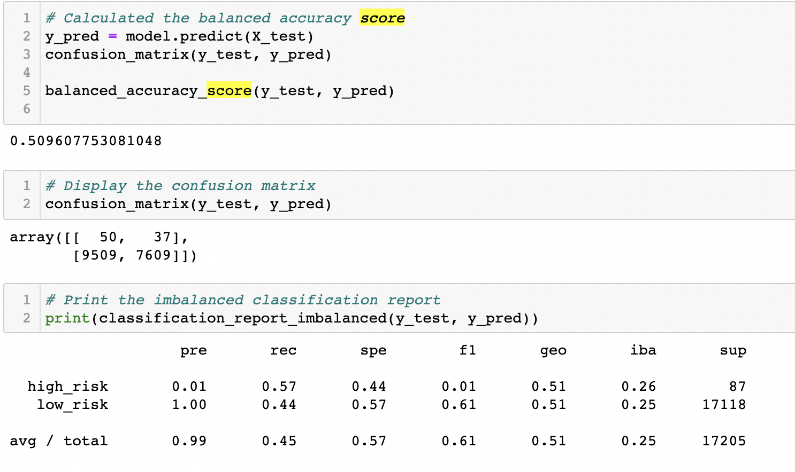
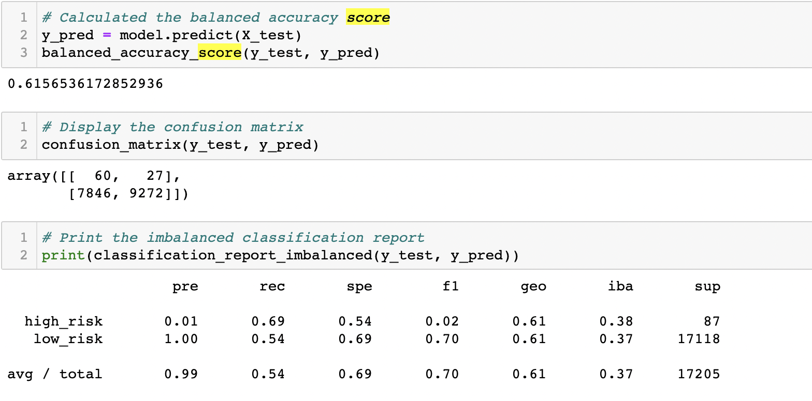
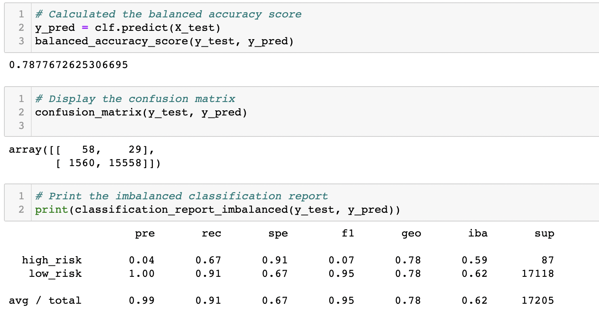
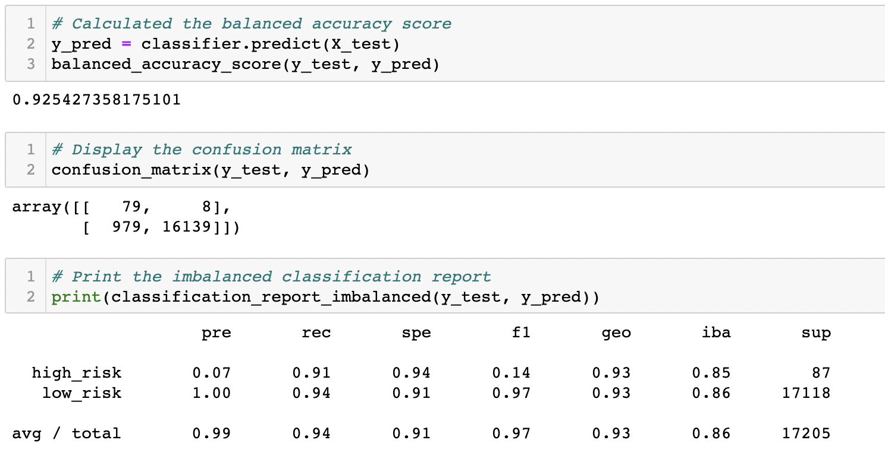

# Credit_Risk_Analysis

## Overview of Analysis

Loans serve as an essential part of the worlds economy. For financial institutions and borrowers most loans are mutually beneficial, however there are instances where the borrower may end up defaulting on a loan resulting in a negative outcome for both parties. To avoid defaults on loans, financial institutions and banks must accurately assess the credit risk of potential borrowers. Financial Institutions have traditionally relied on factors such as income, credit scores collateral assets to asses lending risk, but the rise of financial technology (Fin Tech) has enabled financial institutions to use machine learning to to analyze risk.

The use of Machine learning to predict credit risk allows financial insitutions to provide a quicker and more reliable loan experience. Machine learning also allows for financial instititions to more accurately predict good loan candidates, which will lower the default rates of loans. For this project, I will be using Python and the Sci-Kit learn library to build and evaluate machine learning models to predict credit risk.

## Results

### Scores By Model

#### Oversampling

1. Naive Random Oversampling
    - Balanced Accuracy Score: .645
    - Precision Score: High = .01
    - Recall Score: High - .61

2. Smote Oversampling
    - Balanced Accuracy Score: .62
    - Precision Score: High = .01
    - Recall Score: High = .61

#### Undersampling

3. ClusterCentroids
    - Balanced Accuracy Score: .509
    - Precision Score: High = .01
    - Recall Score: High = .57

#### Over-and-Under Sampling
4. SMOOTEENN
    - Balanced Accuracy Score: .616
    - Precision Score: High = .01
    - Recall Score: High = .69, Low = .54

#### Ensemble Classifiers
5. BalancedRandomForestClassifier
    - Balanced Accuracy Score: .787
    - Precision Score: High = .04
    - Recall Score: High = .67, Low = .91

6. EasyEnsembleClassifier
    - Balanced Accuracy Score: .925
    - Precision Score: High = .07
    - Recall Score: High = .91, Low = .94

## Summary

Considering that most loans are low risk we are mostly focused on the accuracy of the high risk predictions. Naturally those with high risk are also were we are likely to have higher default rates on loans which will inevitably lead to a loss of profits for our financial institution.

For the over sampling method we see that the model is fairly accurate, between 62% to 65% accurate. For the undersampled model we see a dissapointing 50% accuracy for our model. With the combination of over and undersampling coming in at 61% accuracy. Our BalancedRandomForestClassifier does come in at a far more impressive 78% accuracy. The EasyEnsembleClassifier is however head an sholders above the other models as it performs at a eye popping 92% accuracy, meaning that it correctly predicted the borrowers risk 92% of the time. 

Considering that we want to catch all borrowers with high risk, we must then focus on our recall score (sensitivity). If someone gets labeled at high risk when they are in fact low risk, the worst thing that happens is that they do not get a loan, and while that is not the ideal case we want for a bank trying to make profits, we can at least hang our hats on the fact that we are not getting a loss. However, if we miss someone who is high-risk for a loan, we will end up loosing money invested in that client. Considering the fact that missing a high risk individual is more detrimental to financial institutions, we must focus on the sensitivity of our scores. When looking at sensitivity, we see that only one model scores higher than 75% on high risk individuals, and that is the EasyEnsembleClassifier which scored 91% accuracy on predicting high risk candidates. 

Based on what I see from the models, I would recommend the EasyEnsembleClassifier. While its hyper agressive nature lables a few low risk individuals as high risk, hence the 94% sensitity score for low risk individuals. We can do away with a few loans if it means we are not loosing money on high risk individuals, and since the low risk accuracy score is still above 90%, I would say that this model performs quite strong overall. 
